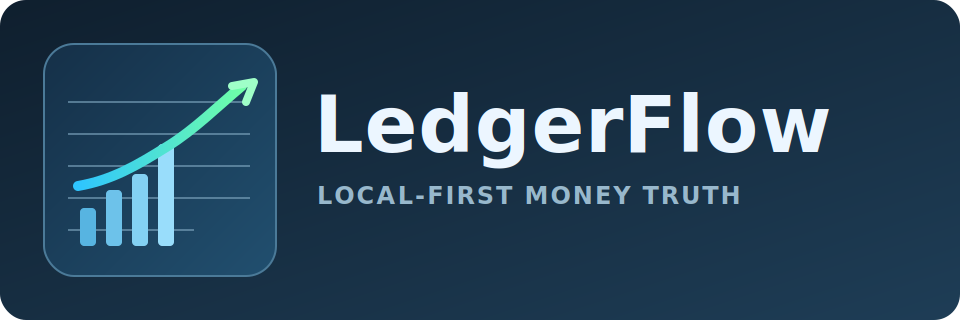

# LedgerFlow



LedgerFlow is a local-first bills and receipts money tracker with:

- append-only ledger storage
- deterministic rebuild via correction events
- CLI + FastAPI + web UI
- OCR/PDF ingestion for receipts and bills
- reports, alerts, and chart datasets
- review queue and reconciliation workflows

## Highlights

- Inputs:
  - bank CSV exports
  - receipt/bill files (`txt`, `pdf`, image formats)
  - manual entries
- Outputs:
  - `data/ledger/transactions.jsonl` and `data/ledger/corrections.jsonl`
  - daily/monthly reports
  - chart-ready JSON datasets
  - alert events + persistent alert state
- Operations:
  - idempotent source registration and CSV import
  - receipt/bill parsing + source artifacts
  - transaction linking (`receipt`/`bill` to `bank_csv`)
  - manual-vs-bank duplicate marking
  - review queue + resolution
- Runtime surfaces:
  - CLI: `python3 -m ledgerflow ...`
  - API: `/api/*` (FastAPI)
  - Web UI: `/`

## Quick Start

```bash
cd /Users/srinivaspendela/Sriinnu/Personal/Ledgerflow
python3 -m pip install -r requirements.txt

# Initialize local data layout
python3 -m ledgerflow init

# Import a bank CSV (dry-run, then commit)
python3 -m ledgerflow import csv data/inbox/bank/statement.csv --sample 5
python3 -m ledgerflow import csv data/inbox/bank/statement.csv --commit

# Add a manual transaction
python3 -m ledgerflow manual add \
  --occurred-at 2026-02-10 \
  --amount -12.30 \
  --currency USD \
  --merchant "Farmers Market" \
  --category-hint groceries \
  --tags cash

# Build caches + reports/charts/alerts
python3 -m ledgerflow build
python3 -m ledgerflow report daily --date 2026-02-10
python3 -m ledgerflow report monthly --month 2026-02
python3 -m ledgerflow charts series --from-date 2026-02-01 --to-date 2026-02-29
python3 -m ledgerflow alerts run --at 2026-02-10
```

## OCR Through CLI

```bash
# Capability checks
python3 -m ledgerflow ocr doctor

# Extract text with explicit OCR backend control
python3 -m ledgerflow ocr extract /path/to/receipt.jpg --image-provider auto --json
python3 -m ledgerflow ocr extract /path/to/receipt.jpg --image-provider tesseract --no-preprocess

# Receipt/Bill ingestion (uses extraction internally)
python3 -m ledgerflow import receipt data/inbox/receipts/receipt.jpg --image-provider openai
python3 -m ledgerflow import bill data/inbox/bills/invoice.pdf
```

## Run API + Web

```bash
python3 -m ledgerflow serve --host 127.0.0.1 --port 8787
```

- Web UI: http://127.0.0.1:8787/
- API docs: http://127.0.0.1:8787/docs

Optional API protection:

```bash
LEDGERFLOW_API_KEY=change-me python3 -m ledgerflow serve --host 127.0.0.1 --port 8787
```

When enabled, `/api/*` (except `/api/health`) requires either:

- `X-API-Key: <token>`
- `Authorization: Bearer <token>`

Mutating API requests are logged to `data/meta/audit.jsonl`.

## Docker

```bash
docker build -t ledgerflow .
docker run --rm -p 8787:8787 -v "$PWD/data:/data" ledgerflow
```

## Testing

```bash
python3 -m unittest discover -s tests
```

## CI

GitHub Actions workflow: `.github/workflows/ci.yml`

Runs:

- Ruff lint
- Mypy type check
- Unit tests
- CLI smoke commands

## Project Docs

- Getting started: `GETTING_STARTED.md`
- CLI: `docs/CLI.md`
- API: `docs/API.md`
- Schemas: `docs/SCHEMAS.md`
- Data layout: `docs/DATA_LAYOUT.md`
- Development: `docs/DEVELOPMENT.md`
- Roadmap status: `docs/ROADMAP.md`
- Product spec source: `SKILL.md`
